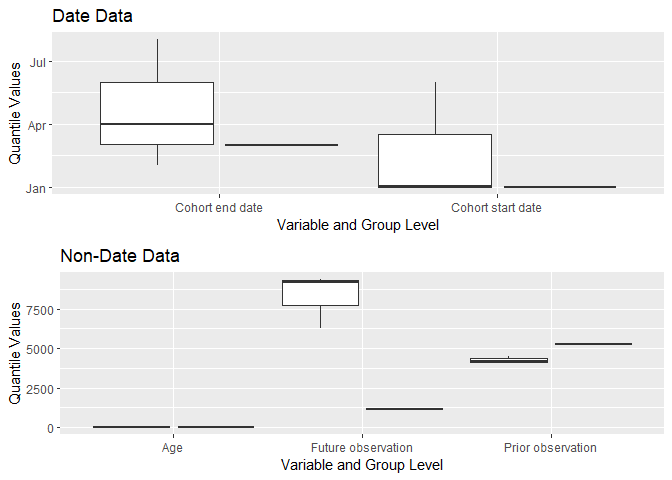

# CohortCharacteristics

[](https://CRAN.R-project.org/package=CohortCharacteristics)
[](https://app.codecov.io/github/darwin-eu-dev/CohortCharacteristics?branch=main)
[](https://github.com/darwin-eu-dev/CohortCharacteristics/actions)
[](https://lifecycle.r-lib.org/articles/stages.html#experimental)

## Package overview

CohortCharacteristics contains functions for summarising characteristics
of cohorts of patients identified in an OMOP CDM dataset. Once a cohort
table has been created, CohortCharacteristics provides a number of
functions to help provide a summary of the characteristics of the
individuals within the cohort.

## Package installation

You can install the latest version of CohortCharacteristics like so:

``` r
install.packages("remotes")
remotes::install_github("darwin-eu-dev/CohortCharacteristics")
```

## Example usage

The CohortCharacteristics package is designed to work with data in the
OMOP CDM format, so our first step is to create a reference to the data
using the CDMConnector package. For this example we will work with the
example Eunomia dataset.

``` r
library(CDMConnector)
library(PatientProfiles)
library(dplyr)
```

``` r
cdm <- mockPatientProfiles(patient_size = 1000, drug_exposure_size = 1000)
cdm
```

We can see that in this example data we have a cohort table called
cohort1.

``` r
cdm$cohort1
#> # Source:   table<main.cohort1> [4 x 4]
#> # Database: DuckDB v0.9.2 [eburn@Windows 10 x64:R 4.2.1/:memory:]
#>   cohort_definition_id subject_id cohort_start_date cohort_end_date
#>                  <dbl>      <dbl> <date>            <date>         
#> 1                    1          1 2020-01-01        2020-04-01     
#> 2                    1          1 2020-06-01        2020-08-01     
#> 3                    1          2 2020-01-02        2020-02-02     
#> 4                    2          3 2020-01-01        2020-03-01
```

With one line of code from CohortCharacteristics we can generate summary
statistics on this cohort.

``` r
cohort1_characteristics <- summariseCharacteristics(cdm$cohort1)
cohort1_characteristics |> 
  glimpse()
#> Rows: 90
#> Columns: 16
#> $ result_id        <int> 1, 1, 1, 1, 1, 1, 1, 1, 1, 1, 1, 1, 1, 1, 1, 1, 1, 1,…
#> $ cdm_name         <chr> "PP_MOCK", "PP_MOCK", "PP_MOCK", "PP_MOCK", "PP_MOCK"…
#> $ result_type      <chr> "summarised_characteristics", "summarised_characteris…
#> $ package_name     <chr> "PatientProfiles", "PatientProfiles", "PatientProfile…
#> $ package_version  <chr> "0.8.0", "0.8.0", "0.8.0", "0.8.0", "0.8.0", "0.8.0",…
#> $ group_name       <chr> "cohort_name", "cohort_name", "cohort_name", "cohort_…
#> $ group_level      <chr> "cohort_1", "cohort_2", "cohort_1", "cohort_2", "coho…
#> $ strata_name      <chr> "overall", "overall", "overall", "overall", "overall"…
#> $ strata_level     <chr> "overall", "overall", "overall", "overall", "overall"…
#> $ variable_name    <chr> "Number records", "Number records", "Number subjects"…
#> $ variable_level   <chr> NA, NA, NA, NA, NA, NA, NA, NA, NA, NA, NA, NA, NA, N…
#> $ estimate_name    <chr> "count", "count", "count", "count", "min", "min", "q0…
#> $ estimate_type    <chr> "integer", "integer", "integer", "integer", "date", "…
#> $ estimate_value   <chr> "3", "1", "2", "1", "2020-01-01", "2020-01-01", "2020…
#> $ additional_name  <chr> "overall", "overall", "overall", "overall", "overall"…
#> $ additional_level <chr> "overall", "overall", "overall", "overall", "overall"…
```

And with another line we can create a table of these results.

``` r
tableCharacteristics(cohort1_characteristics)
```

<div id="qkqvqxjqme" style="padding-left:0px;padding-right:0px;padding-top:10px;padding-bottom:10px;overflow-x:auto;overflow-y:auto;width:auto;height:auto;">
<style>#qkqvqxjqme table {
  font-family: system-ui, 'Segoe UI', Roboto, Helvetica, Arial, sans-serif, 'Apple Color Emoji', 'Segoe UI Emoji', 'Segoe UI Symbol', 'Noto Color Emoji';
  -webkit-font-smoothing: antialiased;
  -moz-osx-font-smoothing: grayscale;
}
&#10;#qkqvqxjqme thead, #qkqvqxjqme tbody, #qkqvqxjqme tfoot, #qkqvqxjqme tr, #qkqvqxjqme td, #qkqvqxjqme th {
  border-style: none;
}
&#10;#qkqvqxjqme p {
  margin: 0;
  padding: 0;
}
&#10;#qkqvqxjqme .gt_table {
  display: table;
  border-collapse: collapse;
  line-height: normal;
  margin-left: auto;
  margin-right: auto;
  color: #333333;
  font-size: 16px;
  font-weight: normal;
  font-style: normal;
  background-color: #FFFFFF;
  width: auto;
  border-top-style: solid;
  border-top-width: 2px;
  border-top-color: #A8A8A8;
  border-right-style: none;
  border-right-width: 2px;
  border-right-color: #D3D3D3;
  border-bottom-style: solid;
  border-bottom-width: 2px;
  border-bottom-color: #A8A8A8;
  border-left-style: none;
  border-left-width: 2px;
  border-left-color: #D3D3D3;
}
&#10;#qkqvqxjqme .gt_caption {
  padding-top: 4px;
  padding-bottom: 4px;
}
&#10;#qkqvqxjqme .gt_title {
  color: #333333;
  font-size: 125%;
  font-weight: initial;
  padding-top: 4px;
  padding-bottom: 4px;
  padding-left: 5px;
  padding-right: 5px;
  border-bottom-color: #FFFFFF;
  border-bottom-width: 0;
}
&#10;#qkqvqxjqme .gt_subtitle {
  color: #333333;
  font-size: 85%;
  font-weight: initial;
  padding-top: 3px;
  padding-bottom: 5px;
  padding-left: 5px;
  padding-right: 5px;
  border-top-color: #FFFFFF;
  border-top-width: 0;
}
&#10;#qkqvqxjqme .gt_heading {
  background-color: #FFFFFF;
  text-align: center;
  border-bottom-color: #FFFFFF;
  border-left-style: none;
  border-left-width: 1px;
  border-left-color: #D3D3D3;
  border-right-style: none;
  border-right-width: 1px;
  border-right-color: #D3D3D3;
}
&#10;#qkqvqxjqme .gt_bottom_border {
  border-bottom-style: solid;
  border-bottom-width: 2px;
  border-bottom-color: #D3D3D3;
}
&#10;#qkqvqxjqme .gt_col_headings {
  border-top-style: solid;
  border-top-width: 2px;
  border-top-color: #D3D3D3;
  border-bottom-style: solid;
  border-bottom-width: 2px;
  border-bottom-color: #D3D3D3;
  border-left-style: none;
  border-left-width: 1px;
  border-left-color: #D3D3D3;
  border-right-style: none;
  border-right-width: 1px;
  border-right-color: #D3D3D3;
}
&#10;#qkqvqxjqme .gt_col_heading {
  color: #333333;
  background-color: #FFFFFF;
  font-size: 100%;
  font-weight: normal;
  text-transform: inherit;
  border-left-style: none;
  border-left-width: 1px;
  border-left-color: #D3D3D3;
  border-right-style: none;
  border-right-width: 1px;
  border-right-color: #D3D3D3;
  vertical-align: bottom;
  padding-top: 5px;
  padding-bottom: 6px;
  padding-left: 5px;
  padding-right: 5px;
  overflow-x: hidden;
}
&#10;#qkqvqxjqme .gt_column_spanner_outer {
  color: #333333;
  background-color: #FFFFFF;
  font-size: 100%;
  font-weight: normal;
  text-transform: inherit;
  padding-top: 0;
  padding-bottom: 0;
  padding-left: 4px;
  padding-right: 4px;
}
&#10;#qkqvqxjqme .gt_column_spanner_outer:first-child {
  padding-left: 0;
}
&#10;#qkqvqxjqme .gt_column_spanner_outer:last-child {
  padding-right: 0;
}
&#10;#qkqvqxjqme .gt_column_spanner {
  border-bottom-style: solid;
  border-bottom-width: 2px;
  border-bottom-color: #D3D3D3;
  vertical-align: bottom;
  padding-top: 5px;
  padding-bottom: 5px;
  overflow-x: hidden;
  display: inline-block;
  width: 100%;
}
&#10;#qkqvqxjqme .gt_spanner_row {
  border-bottom-style: hidden;
}
&#10;#qkqvqxjqme .gt_group_heading {
  padding-top: 8px;
  padding-bottom: 8px;
  padding-left: 5px;
  padding-right: 5px;
  color: #333333;
  background-color: #FFFFFF;
  font-size: 100%;
  font-weight: initial;
  text-transform: inherit;
  border-top-style: solid;
  border-top-width: 2px;
  border-top-color: #D3D3D3;
  border-bottom-style: solid;
  border-bottom-width: 2px;
  border-bottom-color: #D3D3D3;
  border-left-style: none;
  border-left-width: 1px;
  border-left-color: #D3D3D3;
  border-right-style: none;
  border-right-width: 1px;
  border-right-color: #D3D3D3;
  vertical-align: middle;
  text-align: left;
}
&#10;#qkqvqxjqme .gt_empty_group_heading {
  padding: 0.5px;
  color: #333333;
  background-color: #FFFFFF;
  font-size: 100%;
  font-weight: initial;
  border-top-style: solid;
  border-top-width: 2px;
  border-top-color: #D3D3D3;
  border-bottom-style: solid;
  border-bottom-width: 2px;
  border-bottom-color: #D3D3D3;
  vertical-align: middle;
}
&#10;#qkqvqxjqme .gt_from_md > :first-child {
  margin-top: 0;
}
&#10;#qkqvqxjqme .gt_from_md > :last-child {
  margin-bottom: 0;
}
&#10;#qkqvqxjqme .gt_row {
  padding-top: 8px;
  padding-bottom: 8px;
  padding-left: 5px;
  padding-right: 5px;
  margin: 10px;
  border-top-style: solid;
  border-top-width: 1px;
  border-top-color: #D3D3D3;
  border-left-style: none;
  border-left-width: 1px;
  border-left-color: #D3D3D3;
  border-right-style: none;
  border-right-width: 1px;
  border-right-color: #D3D3D3;
  vertical-align: middle;
  overflow-x: hidden;
}
&#10;#qkqvqxjqme .gt_stub {
  color: #333333;
  background-color: #FFFFFF;
  font-size: 100%;
  font-weight: initial;
  text-transform: inherit;
  border-right-style: solid;
  border-right-width: 2px;
  border-right-color: #D3D3D3;
  padding-left: 5px;
  padding-right: 5px;
}
&#10;#qkqvqxjqme .gt_stub_row_group {
  color: #333333;
  background-color: #FFFFFF;
  font-size: 100%;
  font-weight: initial;
  text-transform: inherit;
  border-right-style: solid;
  border-right-width: 2px;
  border-right-color: #D3D3D3;
  padding-left: 5px;
  padding-right: 5px;
  vertical-align: top;
}
&#10;#qkqvqxjqme .gt_row_group_first td {
  border-top-width: 2px;
}
&#10;#qkqvqxjqme .gt_row_group_first th {
  border-top-width: 2px;
}
&#10;#qkqvqxjqme .gt_summary_row {
  color: #333333;
  background-color: #FFFFFF;
  text-transform: inherit;
  padding-top: 8px;
  padding-bottom: 8px;
  padding-left: 5px;
  padding-right: 5px;
}
&#10;#qkqvqxjqme .gt_first_summary_row {
  border-top-style: solid;
  border-top-color: #D3D3D3;
}
&#10;#qkqvqxjqme .gt_first_summary_row.thick {
  border-top-width: 2px;
}
&#10;#qkqvqxjqme .gt_last_summary_row {
  padding-top: 8px;
  padding-bottom: 8px;
  padding-left: 5px;
  padding-right: 5px;
  border-bottom-style: solid;
  border-bottom-width: 2px;
  border-bottom-color: #D3D3D3;
}
&#10;#qkqvqxjqme .gt_grand_summary_row {
  color: #333333;
  background-color: #FFFFFF;
  text-transform: inherit;
  padding-top: 8px;
  padding-bottom: 8px;
  padding-left: 5px;
  padding-right: 5px;
}
&#10;#qkqvqxjqme .gt_first_grand_summary_row {
  padding-top: 8px;
  padding-bottom: 8px;
  padding-left: 5px;
  padding-right: 5px;
  border-top-style: double;
  border-top-width: 6px;
  border-top-color: #D3D3D3;
}
&#10;#qkqvqxjqme .gt_last_grand_summary_row_top {
  padding-top: 8px;
  padding-bottom: 8px;
  padding-left: 5px;
  padding-right: 5px;
  border-bottom-style: double;
  border-bottom-width: 6px;
  border-bottom-color: #D3D3D3;
}
&#10;#qkqvqxjqme .gt_striped {
  background-color: rgba(128, 128, 128, 0.05);
}
&#10;#qkqvqxjqme .gt_table_body {
  border-top-style: solid;
  border-top-width: 2px;
  border-top-color: #D3D3D3;
  border-bottom-style: solid;
  border-bottom-width: 2px;
  border-bottom-color: #D3D3D3;
}
&#10;#qkqvqxjqme .gt_footnotes {
  color: #333333;
  background-color: #FFFFFF;
  border-bottom-style: none;
  border-bottom-width: 2px;
  border-bottom-color: #D3D3D3;
  border-left-style: none;
  border-left-width: 2px;
  border-left-color: #D3D3D3;
  border-right-style: none;
  border-right-width: 2px;
  border-right-color: #D3D3D3;
}
&#10;#qkqvqxjqme .gt_footnote {
  margin: 0px;
  font-size: 90%;
  padding-top: 4px;
  padding-bottom: 4px;
  padding-left: 5px;
  padding-right: 5px;
}
&#10;#qkqvqxjqme .gt_sourcenotes {
  color: #333333;
  background-color: #FFFFFF;
  border-bottom-style: none;
  border-bottom-width: 2px;
  border-bottom-color: #D3D3D3;
  border-left-style: none;
  border-left-width: 2px;
  border-left-color: #D3D3D3;
  border-right-style: none;
  border-right-width: 2px;
  border-right-color: #D3D3D3;
}
&#10;#qkqvqxjqme .gt_sourcenote {
  font-size: 90%;
  padding-top: 4px;
  padding-bottom: 4px;
  padding-left: 5px;
  padding-right: 5px;
}
&#10;#qkqvqxjqme .gt_left {
  text-align: left;
}
&#10;#qkqvqxjqme .gt_center {
  text-align: center;
}
&#10;#qkqvqxjqme .gt_right {
  text-align: right;
  font-variant-numeric: tabular-nums;
}
&#10;#qkqvqxjqme .gt_font_normal {
  font-weight: normal;
}
&#10;#qkqvqxjqme .gt_font_bold {
  font-weight: bold;
}
&#10;#qkqvqxjqme .gt_font_italic {
  font-style: italic;
}
&#10;#qkqvqxjqme .gt_super {
  font-size: 65%;
}
&#10;#qkqvqxjqme .gt_footnote_marks {
  font-size: 75%;
  vertical-align: 0.4em;
  position: initial;
}
&#10;#qkqvqxjqme .gt_asterisk {
  font-size: 100%;
  vertical-align: 0;
}
&#10;#qkqvqxjqme .gt_indent_1 {
  text-indent: 5px;
}
&#10;#qkqvqxjqme .gt_indent_2 {
  text-indent: 10px;
}
&#10;#qkqvqxjqme .gt_indent_3 {
  text-indent: 15px;
}
&#10;#qkqvqxjqme .gt_indent_4 {
  text-indent: 20px;
}
&#10;#qkqvqxjqme .gt_indent_5 {
  text-indent: 25px;
}
</style>
<table class="gt_table" data-quarto-disable-processing="false" data-quarto-bootstrap="false">
  <thead>
    &#10;    <tr class="gt_col_headings gt_spanner_row">
      <th class="gt_col_heading gt_columns_bottom_border gt_left" rowspan="2" colspan="1" style="text-align: center; font-weight: bold;" scope="col" id="CDM name">CDM name</th>
      <th class="gt_col_heading gt_columns_bottom_border gt_left" rowspan="2" colspan="1" style="text-align: center; font-weight: bold;" scope="col" id="Variable name">Variable name</th>
      <th class="gt_col_heading gt_columns_bottom_border gt_left" rowspan="2" colspan="1" style="text-align: center; font-weight: bold;" scope="col" id="Variable level">Variable level</th>
      <th class="gt_col_heading gt_columns_bottom_border gt_left" rowspan="2" colspan="1" style="text-align: center; font-weight: bold;" scope="col" id="Estimate name">Estimate name</th>
      <th class="gt_center gt_columns_top_border gt_column_spanner_outer" rowspan="1" colspan="2" style="background-color: #C8C8C8; text-align: center; font-weight: bold;" scope="colgroup" id="Cohort name">
        <span class="gt_column_spanner">Cohort name</span>
      </th>
    </tr>
    <tr class="gt_col_headings">
      <th class="gt_col_heading gt_columns_bottom_border gt_left" rowspan="1" colspan="1" style="background-color: #E1E1E1; text-align: center; font-weight: bold;" scope="col" id="Cohort 1">Cohort 1</th>
      <th class="gt_col_heading gt_columns_bottom_border gt_left" rowspan="1" colspan="1" style="background-color: #E1E1E1; text-align: center; font-weight: bold;" scope="col" id="Cohort 2">Cohort 2</th>
    </tr>
  </thead>
  <tbody class="gt_table_body">
    <tr><td headers="CDM name" class="gt_row gt_left" style="text-align: left;">PP_MOCK</td>
<td headers="Variable name" class="gt_row gt_left" style="text-align: left; border-left-width: 1px; border-left-style: solid; border-left-color: #D3D3D3; border-right-width: 1px; border-right-style: solid; border-right-color: #D3D3D3; border-top-width: 1px; border-top-style: solid; border-top-color: #D3D3D3; border-bottom-width: 1px; border-bottom-style: solid; border-bottom-color: #D3D3D3;">Number records</td>
<td headers="Variable level" class="gt_row gt_left" style="text-align: left; border-left-width: 1px; border-left-style: solid; border-left-color: #D3D3D3; border-right-width: 1px; border-right-style: solid; border-right-color: #D3D3D3; border-top-width: 1px; border-top-style: solid; border-top-color: #D3D3D3; border-bottom-width: 1px; border-bottom-style: solid; border-bottom-color: #D3D3D3;">-</td>
<td headers="Estimate name" class="gt_row gt_left" style="text-align: left; border-left-width: 1px; border-left-style: solid; border-left-color: #D3D3D3; border-right-width: 1px; border-right-style: solid; border-right-color: #D3D3D3; border-top-width: 1px; border-top-style: solid; border-top-color: #D3D3D3; border-bottom-width: 1px; border-bottom-style: solid; border-bottom-color: #D3D3D3;">N</td>
<td headers="[header]Cohort name
[header_level]Cohort 1" class="gt_row gt_left" style="text-align: right; border-left-width: 1px; border-left-style: solid; border-left-color: #D3D3D3; border-right-width: 1px; border-right-style: solid; border-right-color: #D3D3D3; border-top-width: 1px; border-top-style: solid; border-top-color: #D3D3D3; border-bottom-width: 1px; border-bottom-style: solid; border-bottom-color: #D3D3D3;">&lt;5</td>
<td headers="[header]Cohort name
[header_level]Cohort 2" class="gt_row gt_left" style="text-align: right;">&lt;5</td></tr>
    <tr><td headers="CDM name" class="gt_row gt_left" style="text-align: left; border-top-width: 1px; border-top-style: hidden; border-top-color: #000000;"></td>
<td headers="Variable name" class="gt_row gt_left" style="text-align: left; border-left-width: 1px; border-left-style: solid; border-left-color: #D3D3D3; border-right-width: 1px; border-right-style: solid; border-right-color: #D3D3D3; border-top-width: 1px; border-top-style: solid; border-top-color: #D3D3D3; border-bottom-width: 1px; border-bottom-style: solid; border-bottom-color: #D3D3D3;">Number subjects</td>
<td headers="Variable level" class="gt_row gt_left" style="text-align: left; border-left-width: 1px; border-left-style: solid; border-left-color: #D3D3D3; border-right-width: 1px; border-right-style: solid; border-right-color: #D3D3D3; border-top-width: 1px; border-top-style: solid; border-top-color: #D3D3D3; border-bottom-width: 1px; border-bottom-style: solid; border-bottom-color: #D3D3D3;">-</td>
<td headers="Estimate name" class="gt_row gt_left" style="text-align: left; border-left-width: 1px; border-left-style: solid; border-left-color: #D3D3D3; border-right-width: 1px; border-right-style: solid; border-right-color: #D3D3D3; border-top-width: 1px; border-top-style: solid; border-top-color: #D3D3D3; border-bottom-width: 1px; border-bottom-style: solid; border-bottom-color: #D3D3D3;">N</td>
<td headers="[header]Cohort name
[header_level]Cohort 1" class="gt_row gt_left" style="text-align: right; border-left-width: 1px; border-left-style: solid; border-left-color: #D3D3D3; border-right-width: 1px; border-right-style: solid; border-right-color: #D3D3D3; border-top-width: 1px; border-top-style: solid; border-top-color: #D3D3D3; border-bottom-width: 1px; border-bottom-style: solid; border-bottom-color: #D3D3D3;">&lt;5</td>
<td headers="[header]Cohort name
[header_level]Cohort 2" class="gt_row gt_left" style="text-align: right;">&lt;5</td></tr>
    <tr><td headers="CDM name" class="gt_row gt_left" style="text-align: left; border-top-width: 1px; border-top-style: hidden; border-top-color: #000000;"></td>
<td headers="Variable name" class="gt_row gt_left" style="text-align: left; border-left-width: 1px; border-left-style: solid; border-left-color: #D3D3D3; border-right-width: 1px; border-right-style: solid; border-right-color: #D3D3D3; border-top-width: 1px; border-top-style: solid; border-top-color: #D3D3D3; border-bottom-width: 1px; border-bottom-style: solid; border-bottom-color: #D3D3D3;">Cohort start date</td>
<td headers="Variable level" class="gt_row gt_left" style="text-align: left; border-left-width: 1px; border-left-style: solid; border-left-color: #D3D3D3; border-right-width: 1px; border-right-style: solid; border-right-color: #D3D3D3; border-top-width: 1px; border-top-style: solid; border-top-color: #D3D3D3; border-bottom-width: 1px; border-bottom-style: solid; border-bottom-color: #D3D3D3;">-</td>
<td headers="Estimate name" class="gt_row gt_left" style="text-align: left; border-left-width: 1px; border-left-style: solid; border-left-color: #D3D3D3; border-right-width: 1px; border-right-style: solid; border-right-color: #D3D3D3; border-top-width: 1px; border-top-style: solid; border-top-color: #D3D3D3; border-bottom-width: 1px; border-bottom-style: solid; border-bottom-color: #D3D3D3;">Median [Q25 - Q75]</td>
<td headers="[header]Cohort name
[header_level]Cohort 1" class="gt_row gt_left" style="text-align: right; border-left-width: 1px; border-left-style: solid; border-left-color: #D3D3D3; border-right-width: 1px; border-right-style: solid; border-right-color: #D3D3D3; border-top-width: 1px; border-top-style: solid; border-top-color: #D3D3D3; border-bottom-width: 1px; border-bottom-style: solid; border-bottom-color: #D3D3D3;">2020-01-02 [2020-01-01 - 2020-03-17]</td>
<td headers="[header]Cohort name
[header_level]Cohort 2" class="gt_row gt_left" style="text-align: right;">2020-01-01 [2020-01-01 - 2020-01-01]</td></tr>
    <tr><td headers="CDM name" class="gt_row gt_left" style="text-align: left; border-top-width: 1px; border-top-style: hidden; border-top-color: #000000;"></td>
<td headers="Variable name" class="gt_row gt_left" style="text-align: left; border-left-width: 1px; border-left-style: solid; border-left-color: #D3D3D3; border-right-width: 1px; border-right-style: solid; border-right-color: #D3D3D3; border-top-width: 1px; border-top-style: hidden; border-top-color: #000000; border-bottom-width: 1px; border-bottom-style: solid; border-bottom-color: #D3D3D3;"></td>
<td headers="Variable level" class="gt_row gt_left" style="text-align: left; border-left-width: 1px; border-left-style: solid; border-left-color: #D3D3D3; border-right-width: 1px; border-right-style: solid; border-right-color: #D3D3D3; border-top-width: 1px; border-top-style: hidden; border-top-color: #000000; border-bottom-width: 1px; border-bottom-style: solid; border-bottom-color: #D3D3D3;"></td>
<td headers="Estimate name" class="gt_row gt_left" style="text-align: left; border-left-width: 1px; border-left-style: solid; border-left-color: #D3D3D3; border-right-width: 1px; border-right-style: solid; border-right-color: #D3D3D3; border-top-width: 1px; border-top-style: solid; border-top-color: #D3D3D3; border-bottom-width: 1px; border-bottom-style: solid; border-bottom-color: #D3D3D3;">[Q05 - Q95]</td>
<td headers="[header]Cohort name
[header_level]Cohort 1" class="gt_row gt_left" style="text-align: right; border-left-width: 1px; border-left-style: solid; border-left-color: #D3D3D3; border-right-width: 1px; border-right-style: solid; border-right-color: #D3D3D3; border-top-width: 1px; border-top-style: solid; border-top-color: #D3D3D3; border-bottom-width: 1px; border-bottom-style: solid; border-bottom-color: #D3D3D3;">[2020-01-01 - 2020-05-17]</td>
<td headers="[header]Cohort name
[header_level]Cohort 2" class="gt_row gt_left" style="text-align: right;">[2020-01-01 - 2020-01-01]</td></tr>
    <tr><td headers="CDM name" class="gt_row gt_left" style="text-align: left; border-top-width: 1px; border-top-style: hidden; border-top-color: #000000;"></td>
<td headers="Variable name" class="gt_row gt_left" style="text-align: left; border-left-width: 1px; border-left-style: solid; border-left-color: #D3D3D3; border-right-width: 1px; border-right-style: solid; border-right-color: #D3D3D3; border-top-width: 1px; border-top-style: hidden; border-top-color: #000000; border-bottom-width: 1px; border-bottom-style: solid; border-bottom-color: #D3D3D3;"></td>
<td headers="Variable level" class="gt_row gt_left" style="text-align: left; border-left-width: 1px; border-left-style: solid; border-left-color: #D3D3D3; border-right-width: 1px; border-right-style: solid; border-right-color: #D3D3D3; border-top-width: 1px; border-top-style: hidden; border-top-color: #000000; border-bottom-width: 1px; border-bottom-style: solid; border-bottom-color: #D3D3D3;"></td>
<td headers="Estimate name" class="gt_row gt_left" style="text-align: left; border-left-width: 1px; border-left-style: solid; border-left-color: #D3D3D3; border-right-width: 1px; border-right-style: solid; border-right-color: #D3D3D3; border-top-width: 1px; border-top-style: solid; border-top-color: #D3D3D3; border-bottom-width: 1px; border-bottom-style: solid; border-bottom-color: #D3D3D3;">Range</td>
<td headers="[header]Cohort name
[header_level]Cohort 1" class="gt_row gt_left" style="text-align: right; border-left-width: 1px; border-left-style: solid; border-left-color: #D3D3D3; border-right-width: 1px; border-right-style: solid; border-right-color: #D3D3D3; border-top-width: 1px; border-top-style: solid; border-top-color: #D3D3D3; border-bottom-width: 1px; border-bottom-style: solid; border-bottom-color: #D3D3D3;">2020-01-01 to 2020-06-01</td>
<td headers="[header]Cohort name
[header_level]Cohort 2" class="gt_row gt_left" style="text-align: right;">2020-01-01 to 2020-01-01</td></tr>
    <tr><td headers="CDM name" class="gt_row gt_left" style="text-align: left; border-top-width: 1px; border-top-style: hidden; border-top-color: #000000;"></td>
<td headers="Variable name" class="gt_row gt_left" style="text-align: left; border-left-width: 1px; border-left-style: solid; border-left-color: #D3D3D3; border-right-width: 1px; border-right-style: solid; border-right-color: #D3D3D3; border-top-width: 1px; border-top-style: solid; border-top-color: #D3D3D3; border-bottom-width: 1px; border-bottom-style: solid; border-bottom-color: #D3D3D3;">Cohort end date</td>
<td headers="Variable level" class="gt_row gt_left" style="text-align: left; border-left-width: 1px; border-left-style: solid; border-left-color: #D3D3D3; border-right-width: 1px; border-right-style: solid; border-right-color: #D3D3D3; border-top-width: 1px; border-top-style: solid; border-top-color: #D3D3D3; border-bottom-width: 1px; border-bottom-style: solid; border-bottom-color: #D3D3D3;">-</td>
<td headers="Estimate name" class="gt_row gt_left" style="text-align: left; border-left-width: 1px; border-left-style: solid; border-left-color: #D3D3D3; border-right-width: 1px; border-right-style: solid; border-right-color: #D3D3D3; border-top-width: 1px; border-top-style: solid; border-top-color: #D3D3D3; border-bottom-width: 1px; border-bottom-style: solid; border-bottom-color: #D3D3D3;">Median [Q25 - Q75]</td>
<td headers="[header]Cohort name
[header_level]Cohort 1" class="gt_row gt_left" style="text-align: right; border-left-width: 1px; border-left-style: solid; border-left-color: #D3D3D3; border-right-width: 1px; border-right-style: solid; border-right-color: #D3D3D3; border-top-width: 1px; border-top-style: solid; border-top-color: #D3D3D3; border-bottom-width: 1px; border-bottom-style: solid; border-bottom-color: #D3D3D3;">2020-04-01 [2020-03-03 - 2020-06-01]</td>
<td headers="[header]Cohort name
[header_level]Cohort 2" class="gt_row gt_left" style="text-align: right;">2020-03-01 [2020-03-01 - 2020-03-01]</td></tr>
    <tr><td headers="CDM name" class="gt_row gt_left" style="text-align: left; border-top-width: 1px; border-top-style: hidden; border-top-color: #000000;"></td>
<td headers="Variable name" class="gt_row gt_left" style="text-align: left; border-left-width: 1px; border-left-style: solid; border-left-color: #D3D3D3; border-right-width: 1px; border-right-style: solid; border-right-color: #D3D3D3; border-top-width: 1px; border-top-style: hidden; border-top-color: #000000; border-bottom-width: 1px; border-bottom-style: solid; border-bottom-color: #D3D3D3;"></td>
<td headers="Variable level" class="gt_row gt_left" style="text-align: left; border-left-width: 1px; border-left-style: solid; border-left-color: #D3D3D3; border-right-width: 1px; border-right-style: solid; border-right-color: #D3D3D3; border-top-width: 1px; border-top-style: hidden; border-top-color: #000000; border-bottom-width: 1px; border-bottom-style: solid; border-bottom-color: #D3D3D3;"></td>
<td headers="Estimate name" class="gt_row gt_left" style="text-align: left; border-left-width: 1px; border-left-style: solid; border-left-color: #D3D3D3; border-right-width: 1px; border-right-style: solid; border-right-color: #D3D3D3; border-top-width: 1px; border-top-style: solid; border-top-color: #D3D3D3; border-bottom-width: 1px; border-bottom-style: solid; border-bottom-color: #D3D3D3;">[Q05 - Q95]</td>
<td headers="[header]Cohort name
[header_level]Cohort 1" class="gt_row gt_left" style="text-align: right; border-left-width: 1px; border-left-style: solid; border-left-color: #D3D3D3; border-right-width: 1px; border-right-style: solid; border-right-color: #D3D3D3; border-top-width: 1px; border-top-style: solid; border-top-color: #D3D3D3; border-bottom-width: 1px; border-bottom-style: solid; border-bottom-color: #D3D3D3;">[2020-02-08 - 2020-07-20]</td>
<td headers="[header]Cohort name
[header_level]Cohort 2" class="gt_row gt_left" style="text-align: right;">[2020-03-01 - 2020-03-01]</td></tr>
    <tr><td headers="CDM name" class="gt_row gt_left" style="text-align: left; border-top-width: 1px; border-top-style: hidden; border-top-color: #000000;"></td>
<td headers="Variable name" class="gt_row gt_left" style="text-align: left; border-left-width: 1px; border-left-style: solid; border-left-color: #D3D3D3; border-right-width: 1px; border-right-style: solid; border-right-color: #D3D3D3; border-top-width: 1px; border-top-style: hidden; border-top-color: #000000; border-bottom-width: 1px; border-bottom-style: solid; border-bottom-color: #D3D3D3;"></td>
<td headers="Variable level" class="gt_row gt_left" style="text-align: left; border-left-width: 1px; border-left-style: solid; border-left-color: #D3D3D3; border-right-width: 1px; border-right-style: solid; border-right-color: #D3D3D3; border-top-width: 1px; border-top-style: hidden; border-top-color: #000000; border-bottom-width: 1px; border-bottom-style: solid; border-bottom-color: #D3D3D3;"></td>
<td headers="Estimate name" class="gt_row gt_left" style="text-align: left; border-left-width: 1px; border-left-style: solid; border-left-color: #D3D3D3; border-right-width: 1px; border-right-style: solid; border-right-color: #D3D3D3; border-top-width: 1px; border-top-style: solid; border-top-color: #D3D3D3; border-bottom-width: 1px; border-bottom-style: solid; border-bottom-color: #D3D3D3;">Range</td>
<td headers="[header]Cohort name
[header_level]Cohort 1" class="gt_row gt_left" style="text-align: right; border-left-width: 1px; border-left-style: solid; border-left-color: #D3D3D3; border-right-width: 1px; border-right-style: solid; border-right-color: #D3D3D3; border-top-width: 1px; border-top-style: solid; border-top-color: #D3D3D3; border-bottom-width: 1px; border-bottom-style: solid; border-bottom-color: #D3D3D3;">2020-02-02 to 2020-08-01</td>
<td headers="[header]Cohort name
[header_level]Cohort 2" class="gt_row gt_left" style="text-align: right;">2020-03-01 to 2020-03-01</td></tr>
    <tr><td headers="CDM name" class="gt_row gt_left" style="text-align: left; border-top-width: 1px; border-top-style: hidden; border-top-color: #000000;"></td>
<td headers="Variable name" class="gt_row gt_left" style="text-align: left; border-left-width: 1px; border-left-style: solid; border-left-color: #D3D3D3; border-right-width: 1px; border-right-style: solid; border-right-color: #D3D3D3; border-top-width: 1px; border-top-style: solid; border-top-color: #D3D3D3; border-bottom-width: 1px; border-bottom-style: solid; border-bottom-color: #D3D3D3;">Age</td>
<td headers="Variable level" class="gt_row gt_left" style="text-align: left; border-left-width: 1px; border-left-style: solid; border-left-color: #D3D3D3; border-right-width: 1px; border-right-style: solid; border-right-color: #D3D3D3; border-top-width: 1px; border-top-style: solid; border-top-color: #D3D3D3; border-bottom-width: 1px; border-bottom-style: solid; border-bottom-color: #D3D3D3;">-</td>
<td headers="Estimate name" class="gt_row gt_left" style="text-align: left; border-left-width: 1px; border-left-style: solid; border-left-color: #D3D3D3; border-right-width: 1px; border-right-style: solid; border-right-color: #D3D3D3; border-top-width: 1px; border-top-style: solid; border-top-color: #D3D3D3; border-bottom-width: 1px; border-bottom-style: solid; border-bottom-color: #D3D3D3;">Median [Q25 - Q75]</td>
<td headers="[header]Cohort name
[header_level]Cohort 1" class="gt_row gt_left" style="text-align: right; border-left-width: 1px; border-left-style: solid; border-left-color: #D3D3D3; border-right-width: 1px; border-right-style: solid; border-right-color: #D3D3D3; border-top-width: 1px; border-top-style: solid; border-top-color: #D3D3D3; border-bottom-width: 1px; border-bottom-style: solid; border-bottom-color: #D3D3D3;">22.00 [22.00 - 47.50]</td>
<td headers="[header]Cohort name
[header_level]Cohort 2" class="gt_row gt_left" style="text-align: right;">21.00 [21.00 - 21.00]</td></tr>
    <tr><td headers="CDM name" class="gt_row gt_left" style="text-align: left; border-top-width: 1px; border-top-style: hidden; border-top-color: #000000;"></td>
<td headers="Variable name" class="gt_row gt_left" style="text-align: left; border-left-width: 1px; border-left-style: solid; border-left-color: #D3D3D3; border-right-width: 1px; border-right-style: solid; border-right-color: #D3D3D3; border-top-width: 1px; border-top-style: hidden; border-top-color: #000000; border-bottom-width: 1px; border-bottom-style: solid; border-bottom-color: #D3D3D3;"></td>
<td headers="Variable level" class="gt_row gt_left" style="text-align: left; border-left-width: 1px; border-left-style: solid; border-left-color: #D3D3D3; border-right-width: 1px; border-right-style: solid; border-right-color: #D3D3D3; border-top-width: 1px; border-top-style: hidden; border-top-color: #000000; border-bottom-width: 1px; border-bottom-style: solid; border-bottom-color: #D3D3D3;"></td>
<td headers="Estimate name" class="gt_row gt_left" style="text-align: left; border-left-width: 1px; border-left-style: solid; border-left-color: #D3D3D3; border-right-width: 1px; border-right-style: solid; border-right-color: #D3D3D3; border-top-width: 1px; border-top-style: solid; border-top-color: #D3D3D3; border-bottom-width: 1px; border-bottom-style: solid; border-bottom-color: #D3D3D3;">[Q05 - Q95]</td>
<td headers="[header]Cohort name
[header_level]Cohort 1" class="gt_row gt_left" style="text-align: right; border-left-width: 1px; border-left-style: solid; border-left-color: #D3D3D3; border-right-width: 1px; border-right-style: solid; border-right-color: #D3D3D3; border-top-width: 1px; border-top-style: solid; border-top-color: #D3D3D3; border-bottom-width: 1px; border-bottom-style: solid; border-bottom-color: #D3D3D3;">[22.00 - 67.90]</td>
<td headers="[header]Cohort name
[header_level]Cohort 2" class="gt_row gt_left" style="text-align: right;">[21.00 - 21.00]</td></tr>
    <tr><td headers="CDM name" class="gt_row gt_left" style="text-align: left; border-top-width: 1px; border-top-style: hidden; border-top-color: #000000;"></td>
<td headers="Variable name" class="gt_row gt_left" style="text-align: left; border-left-width: 1px; border-left-style: solid; border-left-color: #D3D3D3; border-right-width: 1px; border-right-style: solid; border-right-color: #D3D3D3; border-top-width: 1px; border-top-style: hidden; border-top-color: #000000; border-bottom-width: 1px; border-bottom-style: solid; border-bottom-color: #D3D3D3;"></td>
<td headers="Variable level" class="gt_row gt_left" style="text-align: left; border-left-width: 1px; border-left-style: solid; border-left-color: #D3D3D3; border-right-width: 1px; border-right-style: solid; border-right-color: #D3D3D3; border-top-width: 1px; border-top-style: hidden; border-top-color: #000000; border-bottom-width: 1px; border-bottom-style: solid; border-bottom-color: #D3D3D3;"></td>
<td headers="Estimate name" class="gt_row gt_left" style="text-align: left; border-left-width: 1px; border-left-style: solid; border-left-color: #D3D3D3; border-right-width: 1px; border-right-style: solid; border-right-color: #D3D3D3; border-top-width: 1px; border-top-style: solid; border-top-color: #D3D3D3; border-bottom-width: 1px; border-bottom-style: solid; border-bottom-color: #D3D3D3;">Mean (SD)</td>
<td headers="[header]Cohort name
[header_level]Cohort 1" class="gt_row gt_left" style="text-align: right; border-left-width: 1px; border-left-style: solid; border-left-color: #D3D3D3; border-right-width: 1px; border-right-style: solid; border-right-color: #D3D3D3; border-top-width: 1px; border-top-style: solid; border-top-color: #D3D3D3; border-bottom-width: 1px; border-bottom-style: solid; border-bottom-color: #D3D3D3;">39.00 (29.44)</td>
<td headers="[header]Cohort name
[header_level]Cohort 2" class="gt_row gt_left" style="text-align: right;">21.00 (&lt;5)</td></tr>
    <tr><td headers="CDM name" class="gt_row gt_left" style="text-align: left; border-top-width: 1px; border-top-style: hidden; border-top-color: #000000;"></td>
<td headers="Variable name" class="gt_row gt_left" style="text-align: left; border-left-width: 1px; border-left-style: solid; border-left-color: #D3D3D3; border-right-width: 1px; border-right-style: solid; border-right-color: #D3D3D3; border-top-width: 1px; border-top-style: hidden; border-top-color: #000000; border-bottom-width: 1px; border-bottom-style: solid; border-bottom-color: #D3D3D3;"></td>
<td headers="Variable level" class="gt_row gt_left" style="text-align: left; border-left-width: 1px; border-left-style: solid; border-left-color: #D3D3D3; border-right-width: 1px; border-right-style: solid; border-right-color: #D3D3D3; border-top-width: 1px; border-top-style: hidden; border-top-color: #000000; border-bottom-width: 1px; border-bottom-style: solid; border-bottom-color: #D3D3D3;"></td>
<td headers="Estimate name" class="gt_row gt_left" style="text-align: left; border-left-width: 1px; border-left-style: solid; border-left-color: #D3D3D3; border-right-width: 1px; border-right-style: solid; border-right-color: #D3D3D3; border-top-width: 1px; border-top-style: solid; border-top-color: #D3D3D3; border-bottom-width: 1px; border-bottom-style: solid; border-bottom-color: #D3D3D3;">Range</td>
<td headers="[header]Cohort name
[header_level]Cohort 1" class="gt_row gt_left" style="text-align: right; border-left-width: 1px; border-left-style: solid; border-left-color: #D3D3D3; border-right-width: 1px; border-right-style: solid; border-right-color: #D3D3D3; border-top-width: 1px; border-top-style: solid; border-top-color: #D3D3D3; border-bottom-width: 1px; border-bottom-style: solid; border-bottom-color: #D3D3D3;">22.00 to 73.00</td>
<td headers="[header]Cohort name
[header_level]Cohort 2" class="gt_row gt_left" style="text-align: right;">21.00 to 21.00</td></tr>
    <tr><td headers="CDM name" class="gt_row gt_left" style="text-align: left; border-top-width: 1px; border-top-style: hidden; border-top-color: #000000;"></td>
<td headers="Variable name" class="gt_row gt_left" style="text-align: left; border-left-width: 1px; border-left-style: solid; border-left-color: #D3D3D3; border-right-width: 1px; border-right-style: solid; border-right-color: #D3D3D3; border-top-width: 1px; border-top-style: solid; border-top-color: #D3D3D3; border-bottom-width: 1px; border-bottom-style: solid; border-bottom-color: #D3D3D3;">Sex</td>
<td headers="Variable level" class="gt_row gt_left" style="text-align: left; border-left-width: 1px; border-left-style: solid; border-left-color: #D3D3D3; border-right-width: 1px; border-right-style: solid; border-right-color: #D3D3D3; border-top-width: 1px; border-top-style: solid; border-top-color: #D3D3D3; border-bottom-width: 1px; border-bottom-style: solid; border-bottom-color: #D3D3D3;">Female</td>
<td headers="Estimate name" class="gt_row gt_left" style="text-align: left; border-left-width: 1px; border-left-style: solid; border-left-color: #D3D3D3; border-right-width: 1px; border-right-style: solid; border-right-color: #D3D3D3; border-top-width: 1px; border-top-style: solid; border-top-color: #D3D3D3; border-bottom-width: 1px; border-bottom-style: solid; border-bottom-color: #D3D3D3;">N (%)</td>
<td headers="[header]Cohort name
[header_level]Cohort 1" class="gt_row gt_left" style="text-align: right; border-left-width: 1px; border-left-style: solid; border-left-color: #D3D3D3; border-right-width: 1px; border-right-style: solid; border-right-color: #D3D3D3; border-top-width: 1px; border-top-style: solid; border-top-color: #D3D3D3; border-bottom-width: 1px; border-bottom-style: solid; border-bottom-color: #D3D3D3;">&lt;5 (&lt;5%)</td>
<td headers="[header]Cohort name
[header_level]Cohort 2" class="gt_row gt_left" style="text-align: right;">-</td></tr>
    <tr><td headers="CDM name" class="gt_row gt_left" style="text-align: left; border-top-width: 1px; border-top-style: hidden; border-top-color: #000000;"></td>
<td headers="Variable name" class="gt_row gt_left" style="text-align: left; border-left-width: 1px; border-left-style: solid; border-left-color: #D3D3D3; border-right-width: 1px; border-right-style: solid; border-right-color: #D3D3D3; border-top-width: 1px; border-top-style: hidden; border-top-color: #000000; border-bottom-width: 1px; border-bottom-style: solid; border-bottom-color: #D3D3D3;"></td>
<td headers="Variable level" class="gt_row gt_left" style="text-align: left; border-left-width: 1px; border-left-style: solid; border-left-color: #D3D3D3; border-right-width: 1px; border-right-style: solid; border-right-color: #D3D3D3; border-top-width: 1px; border-top-style: solid; border-top-color: #D3D3D3; border-bottom-width: 1px; border-bottom-style: solid; border-bottom-color: #D3D3D3;">Male</td>
<td headers="Estimate name" class="gt_row gt_left" style="text-align: left; border-left-width: 1px; border-left-style: solid; border-left-color: #D3D3D3; border-right-width: 1px; border-right-style: solid; border-right-color: #D3D3D3; border-top-width: 1px; border-top-style: solid; border-top-color: #D3D3D3; border-bottom-width: 1px; border-bottom-style: solid; border-bottom-color: #D3D3D3;">N (%)</td>
<td headers="[header]Cohort name
[header_level]Cohort 1" class="gt_row gt_left" style="text-align: right; border-left-width: 1px; border-left-style: solid; border-left-color: #D3D3D3; border-right-width: 1px; border-right-style: solid; border-right-color: #D3D3D3; border-top-width: 1px; border-top-style: solid; border-top-color: #D3D3D3; border-bottom-width: 1px; border-bottom-style: solid; border-bottom-color: #D3D3D3;">-</td>
<td headers="[header]Cohort name
[header_level]Cohort 2" class="gt_row gt_left" style="text-align: right;">&lt;5 (&lt;5%)</td></tr>
    <tr><td headers="CDM name" class="gt_row gt_left" style="text-align: left; border-top-width: 1px; border-top-style: hidden; border-top-color: #000000;"></td>
<td headers="Variable name" class="gt_row gt_left" style="text-align: left; border-left-width: 1px; border-left-style: solid; border-left-color: #D3D3D3; border-right-width: 1px; border-right-style: solid; border-right-color: #D3D3D3; border-top-width: 1px; border-top-style: solid; border-top-color: #D3D3D3; border-bottom-width: 1px; border-bottom-style: solid; border-bottom-color: #D3D3D3;">Prior observation</td>
<td headers="Variable level" class="gt_row gt_left" style="text-align: left; border-left-width: 1px; border-left-style: solid; border-left-color: #D3D3D3; border-right-width: 1px; border-right-style: solid; border-right-color: #D3D3D3; border-top-width: 1px; border-top-style: solid; border-top-color: #D3D3D3; border-bottom-width: 1px; border-bottom-style: solid; border-bottom-color: #D3D3D3;">-</td>
<td headers="Estimate name" class="gt_row gt_left" style="text-align: left; border-left-width: 1px; border-left-style: solid; border-left-color: #D3D3D3; border-right-width: 1px; border-right-style: solid; border-right-color: #D3D3D3; border-top-width: 1px; border-top-style: solid; border-top-color: #D3D3D3; border-bottom-width: 1px; border-bottom-style: solid; border-bottom-color: #D3D3D3;">Median [Q25 - Q75]</td>
<td headers="[header]Cohort name
[header_level]Cohort 1" class="gt_row gt_left" style="text-align: right; border-left-width: 1px; border-left-style: solid; border-left-color: #D3D3D3; border-right-width: 1px; border-right-style: solid; border-right-color: #D3D3D3; border-top-width: 1px; border-top-style: solid; border-top-color: #D3D3D3; border-bottom-width: 1px; border-bottom-style: solid; border-bottom-color: #D3D3D3;">4,209.00 [4,133.00 - 4,347.50]</td>
<td headers="[header]Cohort name
[header_level]Cohort 2" class="gt_row gt_left" style="text-align: right;">5,267.00 [5,267.00 - 5,267.00]</td></tr>
    <tr><td headers="CDM name" class="gt_row gt_left" style="text-align: left; border-top-width: 1px; border-top-style: hidden; border-top-color: #000000;"></td>
<td headers="Variable name" class="gt_row gt_left" style="text-align: left; border-left-width: 1px; border-left-style: solid; border-left-color: #D3D3D3; border-right-width: 1px; border-right-style: solid; border-right-color: #D3D3D3; border-top-width: 1px; border-top-style: hidden; border-top-color: #000000; border-bottom-width: 1px; border-bottom-style: solid; border-bottom-color: #D3D3D3;"></td>
<td headers="Variable level" class="gt_row gt_left" style="text-align: left; border-left-width: 1px; border-left-style: solid; border-left-color: #D3D3D3; border-right-width: 1px; border-right-style: solid; border-right-color: #D3D3D3; border-top-width: 1px; border-top-style: hidden; border-top-color: #000000; border-bottom-width: 1px; border-bottom-style: solid; border-bottom-color: #D3D3D3;"></td>
<td headers="Estimate name" class="gt_row gt_left" style="text-align: left; border-left-width: 1px; border-left-style: solid; border-left-color: #D3D3D3; border-right-width: 1px; border-right-style: solid; border-right-color: #D3D3D3; border-top-width: 1px; border-top-style: solid; border-top-color: #D3D3D3; border-bottom-width: 1px; border-bottom-style: solid; border-bottom-color: #D3D3D3;">[Q05 - Q95]</td>
<td headers="[header]Cohort name
[header_level]Cohort 1" class="gt_row gt_left" style="text-align: right; border-left-width: 1px; border-left-style: solid; border-left-color: #D3D3D3; border-right-width: 1px; border-right-style: solid; border-right-color: #D3D3D3; border-top-width: 1px; border-top-style: solid; border-top-color: #D3D3D3; border-bottom-width: 1px; border-bottom-style: solid; border-bottom-color: #D3D3D3;">[4,072.20 - 4,458.30]</td>
<td headers="[header]Cohort name
[header_level]Cohort 2" class="gt_row gt_left" style="text-align: right;">[5,267.00 - 5,267.00]</td></tr>
    <tr><td headers="CDM name" class="gt_row gt_left" style="text-align: left; border-top-width: 1px; border-top-style: hidden; border-top-color: #000000;"></td>
<td headers="Variable name" class="gt_row gt_left" style="text-align: left; border-left-width: 1px; border-left-style: solid; border-left-color: #D3D3D3; border-right-width: 1px; border-right-style: solid; border-right-color: #D3D3D3; border-top-width: 1px; border-top-style: hidden; border-top-color: #000000; border-bottom-width: 1px; border-bottom-style: solid; border-bottom-color: #D3D3D3;"></td>
<td headers="Variable level" class="gt_row gt_left" style="text-align: left; border-left-width: 1px; border-left-style: solid; border-left-color: #D3D3D3; border-right-width: 1px; border-right-style: solid; border-right-color: #D3D3D3; border-top-width: 1px; border-top-style: hidden; border-top-color: #000000; border-bottom-width: 1px; border-bottom-style: solid; border-bottom-color: #D3D3D3;"></td>
<td headers="Estimate name" class="gt_row gt_left" style="text-align: left; border-left-width: 1px; border-left-style: solid; border-left-color: #D3D3D3; border-right-width: 1px; border-right-style: solid; border-right-color: #D3D3D3; border-top-width: 1px; border-top-style: solid; border-top-color: #D3D3D3; border-bottom-width: 1px; border-bottom-style: solid; border-bottom-color: #D3D3D3;">Mean (SD)</td>
<td headers="[header]Cohort name
[header_level]Cohort 1" class="gt_row gt_left" style="text-align: right; border-left-width: 1px; border-left-style: solid; border-left-color: #D3D3D3; border-right-width: 1px; border-right-style: solid; border-right-color: #D3D3D3; border-top-width: 1px; border-top-style: solid; border-top-color: #D3D3D3; border-bottom-width: 1px; border-bottom-style: solid; border-bottom-color: #D3D3D3;">4,250.67 (217.51)</td>
<td headers="[header]Cohort name
[header_level]Cohort 2" class="gt_row gt_left" style="text-align: right;">5,267.00 (&lt;5)</td></tr>
    <tr><td headers="CDM name" class="gt_row gt_left" style="text-align: left; border-top-width: 1px; border-top-style: hidden; border-top-color: #000000;"></td>
<td headers="Variable name" class="gt_row gt_left" style="text-align: left; border-left-width: 1px; border-left-style: solid; border-left-color: #D3D3D3; border-right-width: 1px; border-right-style: solid; border-right-color: #D3D3D3; border-top-width: 1px; border-top-style: hidden; border-top-color: #000000; border-bottom-width: 1px; border-bottom-style: solid; border-bottom-color: #D3D3D3;"></td>
<td headers="Variable level" class="gt_row gt_left" style="text-align: left; border-left-width: 1px; border-left-style: solid; border-left-color: #D3D3D3; border-right-width: 1px; border-right-style: solid; border-right-color: #D3D3D3; border-top-width: 1px; border-top-style: hidden; border-top-color: #000000; border-bottom-width: 1px; border-bottom-style: solid; border-bottom-color: #D3D3D3;"></td>
<td headers="Estimate name" class="gt_row gt_left" style="text-align: left; border-left-width: 1px; border-left-style: solid; border-left-color: #D3D3D3; border-right-width: 1px; border-right-style: solid; border-right-color: #D3D3D3; border-top-width: 1px; border-top-style: solid; border-top-color: #D3D3D3; border-bottom-width: 1px; border-bottom-style: solid; border-bottom-color: #D3D3D3;">Range</td>
<td headers="[header]Cohort name
[header_level]Cohort 1" class="gt_row gt_left" style="text-align: right; border-left-width: 1px; border-left-style: solid; border-left-color: #D3D3D3; border-right-width: 1px; border-right-style: solid; border-right-color: #D3D3D3; border-top-width: 1px; border-top-style: solid; border-top-color: #D3D3D3; border-bottom-width: 1px; border-bottom-style: solid; border-bottom-color: #D3D3D3;">4,057.00 to 4,486.00</td>
<td headers="[header]Cohort name
[header_level]Cohort 2" class="gt_row gt_left" style="text-align: right;">5,267.00 to 5,267.00</td></tr>
    <tr><td headers="CDM name" class="gt_row gt_left" style="text-align: left; border-top-width: 1px; border-top-style: hidden; border-top-color: #000000;"></td>
<td headers="Variable name" class="gt_row gt_left" style="text-align: left; border-left-width: 1px; border-left-style: solid; border-left-color: #D3D3D3; border-right-width: 1px; border-right-style: solid; border-right-color: #D3D3D3; border-top-width: 1px; border-top-style: solid; border-top-color: #D3D3D3; border-bottom-width: 1px; border-bottom-style: solid; border-bottom-color: #D3D3D3;">Future observation</td>
<td headers="Variable level" class="gt_row gt_left" style="text-align: left; border-left-width: 1px; border-left-style: solid; border-left-color: #D3D3D3; border-right-width: 1px; border-right-style: solid; border-right-color: #D3D3D3; border-top-width: 1px; border-top-style: solid; border-top-color: #D3D3D3; border-bottom-width: 1px; border-bottom-style: solid; border-bottom-color: #D3D3D3;">-</td>
<td headers="Estimate name" class="gt_row gt_left" style="text-align: left; border-left-width: 1px; border-left-style: solid; border-left-color: #D3D3D3; border-right-width: 1px; border-right-style: solid; border-right-color: #D3D3D3; border-top-width: 1px; border-top-style: solid; border-top-color: #D3D3D3; border-bottom-width: 1px; border-bottom-style: solid; border-bottom-color: #D3D3D3;">Median [Q25 - Q75]</td>
<td headers="[header]Cohort name
[header_level]Cohort 1" class="gt_row gt_left" style="text-align: right; border-left-width: 1px; border-left-style: solid; border-left-color: #D3D3D3; border-right-width: 1px; border-right-style: solid; border-right-color: #D3D3D3; border-top-width: 1px; border-top-style: solid; border-top-color: #D3D3D3; border-bottom-width: 1px; border-bottom-style: solid; border-bottom-color: #D3D3D3;">9,196.00 [7,746.00 - 9,272.00]</td>
<td headers="[header]Cohort name
[header_level]Cohort 2" class="gt_row gt_left" style="text-align: right;">1,121.00 [1,121.00 - 1,121.00]</td></tr>
    <tr><td headers="CDM name" class="gt_row gt_left" style="text-align: left; border-top-width: 1px; border-top-style: hidden; border-top-color: #000000;"></td>
<td headers="Variable name" class="gt_row gt_left" style="text-align: left; border-left-width: 1px; border-left-style: solid; border-left-color: #D3D3D3; border-right-width: 1px; border-right-style: solid; border-right-color: #D3D3D3; border-top-width: 1px; border-top-style: hidden; border-top-color: #000000; border-bottom-width: 1px; border-bottom-style: solid; border-bottom-color: #D3D3D3;"></td>
<td headers="Variable level" class="gt_row gt_left" style="text-align: left; border-left-width: 1px; border-left-style: solid; border-left-color: #D3D3D3; border-right-width: 1px; border-right-style: solid; border-right-color: #D3D3D3; border-top-width: 1px; border-top-style: hidden; border-top-color: #000000; border-bottom-width: 1px; border-bottom-style: solid; border-bottom-color: #D3D3D3;"></td>
<td headers="Estimate name" class="gt_row gt_left" style="text-align: left; border-left-width: 1px; border-left-style: solid; border-left-color: #D3D3D3; border-right-width: 1px; border-right-style: solid; border-right-color: #D3D3D3; border-top-width: 1px; border-top-style: solid; border-top-color: #D3D3D3; border-bottom-width: 1px; border-bottom-style: solid; border-bottom-color: #D3D3D3;">[Q05 - Q95]</td>
<td headers="[header]Cohort name
[header_level]Cohort 1" class="gt_row gt_left" style="text-align: right; border-left-width: 1px; border-left-style: solid; border-left-color: #D3D3D3; border-right-width: 1px; border-right-style: solid; border-right-color: #D3D3D3; border-top-width: 1px; border-top-style: solid; border-top-color: #D3D3D3; border-bottom-width: 1px; border-bottom-style: solid; border-bottom-color: #D3D3D3;">[6,586.00 - 9,332.80]</td>
<td headers="[header]Cohort name
[header_level]Cohort 2" class="gt_row gt_left" style="text-align: right;">[1,121.00 - 1,121.00]</td></tr>
    <tr><td headers="CDM name" class="gt_row gt_left" style="text-align: left; border-top-width: 1px; border-top-style: hidden; border-top-color: #000000;"></td>
<td headers="Variable name" class="gt_row gt_left" style="text-align: left; border-left-width: 1px; border-left-style: solid; border-left-color: #D3D3D3; border-right-width: 1px; border-right-style: solid; border-right-color: #D3D3D3; border-top-width: 1px; border-top-style: hidden; border-top-color: #000000; border-bottom-width: 1px; border-bottom-style: solid; border-bottom-color: #D3D3D3;"></td>
<td headers="Variable level" class="gt_row gt_left" style="text-align: left; border-left-width: 1px; border-left-style: solid; border-left-color: #D3D3D3; border-right-width: 1px; border-right-style: solid; border-right-color: #D3D3D3; border-top-width: 1px; border-top-style: hidden; border-top-color: #000000; border-bottom-width: 1px; border-bottom-style: solid; border-bottom-color: #D3D3D3;"></td>
<td headers="Estimate name" class="gt_row gt_left" style="text-align: left; border-left-width: 1px; border-left-style: solid; border-left-color: #D3D3D3; border-right-width: 1px; border-right-style: solid; border-right-color: #D3D3D3; border-top-width: 1px; border-top-style: solid; border-top-color: #D3D3D3; border-bottom-width: 1px; border-bottom-style: solid; border-bottom-color: #D3D3D3;">Mean (SD)</td>
<td headers="[header]Cohort name
[header_level]Cohort 1" class="gt_row gt_left" style="text-align: right; border-left-width: 1px; border-left-style: solid; border-left-color: #D3D3D3; border-right-width: 1px; border-right-style: solid; border-right-color: #D3D3D3; border-top-width: 1px; border-top-style: solid; border-top-color: #D3D3D3; border-bottom-width: 1px; border-bottom-style: solid; border-bottom-color: #D3D3D3;">8,280.00 (1,719.87)</td>
<td headers="[header]Cohort name
[header_level]Cohort 2" class="gt_row gt_left" style="text-align: right;">1,121.00 (&lt;5)</td></tr>
    <tr><td headers="CDM name" class="gt_row gt_left" style="text-align: left; border-top-width: 1px; border-top-style: hidden; border-top-color: #000000;"></td>
<td headers="Variable name" class="gt_row gt_left" style="text-align: left; border-left-width: 1px; border-left-style: solid; border-left-color: #D3D3D3; border-right-width: 1px; border-right-style: solid; border-right-color: #D3D3D3; border-top-width: 1px; border-top-style: hidden; border-top-color: #000000; border-bottom-width: 1px; border-bottom-style: solid; border-bottom-color: #D3D3D3;"></td>
<td headers="Variable level" class="gt_row gt_left" style="text-align: left; border-left-width: 1px; border-left-style: solid; border-left-color: #D3D3D3; border-right-width: 1px; border-right-style: solid; border-right-color: #D3D3D3; border-top-width: 1px; border-top-style: hidden; border-top-color: #000000; border-bottom-width: 1px; border-bottom-style: solid; border-bottom-color: #D3D3D3;"></td>
<td headers="Estimate name" class="gt_row gt_left" style="text-align: left; border-left-width: 1px; border-left-style: solid; border-left-color: #D3D3D3; border-right-width: 1px; border-right-style: solid; border-right-color: #D3D3D3; border-top-width: 1px; border-top-style: solid; border-top-color: #D3D3D3; border-bottom-width: 1px; border-bottom-style: solid; border-bottom-color: #D3D3D3;">Range</td>
<td headers="[header]Cohort name
[header_level]Cohort 1" class="gt_row gt_left" style="text-align: right; border-left-width: 1px; border-left-style: solid; border-left-color: #D3D3D3; border-right-width: 1px; border-right-style: solid; border-right-color: #D3D3D3; border-top-width: 1px; border-top-style: solid; border-top-color: #D3D3D3; border-bottom-width: 1px; border-bottom-style: solid; border-bottom-color: #D3D3D3;">6,296.00 to 9,348.00</td>
<td headers="[header]Cohort name
[header_level]Cohort 2" class="gt_row gt_left" style="text-align: right;">1,121.00 to 1,121.00</td></tr>
  </tbody>
  &#10;  
</table>
</div>

With one more we can create a plot. For example here we create a set of
box-plots.

``` r
plotCharacteristics(cohort1_characteristics, plotStyle = "boxplot")
```



CohortCharacteristics provides a number of other functions to help
summarise cohort tables. These include summaries of cohort overlaps and
timings between cohort entries, intersections with other cohort tables
or tables containing clinical data, as well as a broader large scale
characterisation of all data held on the individuals across the
different tables of the OMOP CDM. These additional functionalities are
summarised in the package vignettes.
